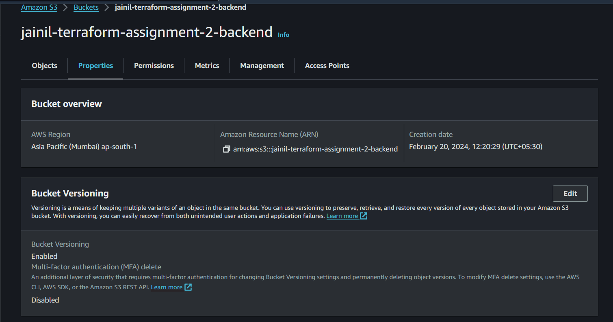

# Assignment 3

## **Objective: Set up Terraform configurations for different environments (e.g., dev, staging, prod) using Terragrunt.**

Introduction: In each environment—development, staging, and production—I establish a robust infrastructure by meticulously configuring Virtual Private Clouds (VPCs) along with private and public subnets. Within these carefully crafted environments, I deploy both private and public EC2 instances, ensuring a secure and efficient setup tailored to the specific needs of each stage of development.

## Managing Multiple Environments with Terragrunt

#### **Introduction**

Terragrunt is a thin wrapper for Terraform that provides extra tools for keeping your configurations DRY, working with multiple Terraform modules, and managing remote state.

**Simplifying Multiple Environments Management:**

- **Terragrunt simplifies managing multiple environments (such as development, staging, and production) by allowing you to:**

- **Keep configurations DRY:** Terragrunt allows you to keep your Terraform configurations DRY (Don't Repeat Yourself) by using configuration inheritance. This means you can define common configurations once and reuse them across multiple environments.

- **Work with multiple Terraform modules:** Terragrunt supports managing multiple Terraform modules in a single repository or across multiple repositories. This allows you to break down your infrastructure into smaller, manageable modules and reuse them across different environments.

- **Manage remote state:** Terragrunt provides built-in support for managing remote state, making it easy to store your Terraform state in a centralized location (e.g., an S3 bucket) and share it across your team.

- **Organize Your Project**: Organize your project directory structure to separate configurations for each environment. For example:

- **Use Terragrunt Configuration:** In each environment directory, create a terragrunt.hcl file to specify Terragrunt configuration, such as remote state settings, backend configuration, and any other Terragrunt-specific settings.

- **Deploy Environment:** To deploy a specific environment, navigate to its directory and run Terragrunt commands such as terragrunt init, terragrunt plan, and terragrunt apply. 

#### **Following is the dir structure:**
<pre>
environments
  │   terragrunt.hcl
  │   
  ├───dev
  │   │   env.hcl
  │   │   
  │   ├───instances
  │   │       terragrunt.hcl
  │   │       
  │   └───vpc
  │           terragrunt.hcl
  │
  ├───prod
  │   │   env.hcl
  │   │   
  │   ├───instances
  │   │       terragrunt.hcl
  │   │       
  │   └───vpc
  │           terragrunt.hcl
  │
  └───staging
      │   env.hcl
      │   
      ├───instances
      │       terragrunt.hcl
      │
      └───vpc
              terragrunt.hcl
</pre>

**Use Terragrunt Configuration:** In environments directory, create a terragrunt.hcl file to specify Terragrunt configuration, such as remote state settings, backend configuration for all environments.

**Deploy Environment:** To deploy a specific environment, navigate to its directory and run Terragrunt commands such as `terragrunt init`, `terragrunt plan`, and `terragrunt apply`.
```bash
cd prod/
terragrunt init
terragrunt plan
terragrunt apply
```
To deploy all environment at once:
```bash
cd environment
terragrunt run-all init
terragrunt run-all plan
terragrunt run-all apply
```

## Requirements
| Name      | Version |
|-----------|---------|
| terraform | = 1.7.3 |
| aws 	     | = 5.37  |

## Providers:

| Name | Version |
|------|---------|
| aws  | = 5.37  |

## Backend:

**Steps to set up backend:**
   1. Create s3 bucket (jainil-terraform-assignment-2-backend) and enable versioning
   2. Create DynamoDB Table (jainil-terraform-lock-table) with partition key named LockID and type String.
   3. Create Policy (S3_w_r_t) give access to following permissions:
        `s3:ListBucket`,
        `s3:GetBucketVersioning`,
        `s3:GetBucketAcl`,
        `s3:GetBucketLogging`,
        `s3:CreateBucket`,
        `s3:PutBucketPublicAccessBlock`,
        `s3:PutBucketTagging`,
        `s3:PutBucketPolicy`,
        `s3:PutBucketVersioning`,
        `s3:PutEncryptionConfiguration`,
        `s3:PutBucketAcl`,
        `s3:PutBucketLogging`,
        `s3:GetEncryptionConfiguration`,
        `s3:GetBucketPolicy`,
        `s3:GetBucketPublicAccessBlock`,
        `s3:PutLifecycleConfiguration`,
        `s3:PutBucketOwnershipControls`
        
   4. Create Policy (Dynamo_w_r_t) give access to `dynamodb:DescribeTable`, `dynamodb:GetItem`, `dynamodb:CreateTable`, `dynamodb:PutItem` and `dynamodb:DeleteItem` and set resource as dynamoDB table's arn.
    
   5. Create New Role (named terraform) and attach 2 policies (Dynamo_w_r_t and S3_w_r_t) created in the previous step.
   6. Now create a new Policy (Allow-Terraform) and provide allow it to assume role of terraform.
   7. Now create a new User-group (named terraform-access) and attach policy (Allow-Terraform) created in the previous step.
   8. Now create a new user (named terra-user) and add it to user group (terraform-access) created in previous step.


## VPC Module:

### Resources:

| Name                        | Type     |
|-----------------------------|----------|
| aws_internet_gateway        | Resource |
| aws_route_table_association | Resource |
| aws_route_table             | Resource |
| aws_subnet                  | Resource |
| aws_vpc                     | Resource |

### Variables:

| Name                       | Description                        | type           | Default          |
|----------------------------|------------------------------------|----------------|------------------|
| env                        | Environment Name                   | `string`       | No Default Value |
| vpc_cidr_block             | VPC's cidr block                   | `string`       | `10.0.0.0/16`    |
| azs                        | List of Availability zones         | `string`       | No Default Value |
| private_subnet_cidr_blocks | List of private subnets cidr block | `list(string)` | `[]`             |
| public_subnet_cidr_blocks  | List of public subnets cidr block  | `list(string)` | `[]`             |
| public_subnet_tags         | Public subnet tags                 | `map(any)`     | `{}`             |
| private_subnet_tags        | Private subnet tags                | `map(any)`     | `{}`             |

### Outputs:

| Name                   | Description                |
|------------------------|----------------------------|
| private_subnet_ids     | List of private subnet IDs |
| public_subnet_ids      | List of public subnet IDs  |
| vpc_id                 | VPC ID                     |
| igw_id                 | Internet Gateway ID        |
| private_route_table_id | Private route table ID     |
| public_route_table_id  | Public route table ID      |

## Instances Module:

### Resources:

| Name                    | Type     |
|-------------------------|----------|
| aws_instance            | Resource | 
| aws_key_pair            | Resource |
| aws_security_group_rule | Resource |
| aws_security_group      | Resource |

### Variables:

| Name                                | Description                                                                                                               | type                                                                                                                                                                                                              | Default                                                                                                                                                                     |
|-------------------------------------|---------------------------------------------------------------------------------------------------------------------------|-------------------------------------------------------------------------------------------------------------------------------------------------------------------------------------------------------------------|-----------------------------------------------------------------------------------------------------------------------------------------------------------------------------|
| env                                 | Environment Name                                                                                                          | `string`                                                                                                                                                                                                          | No Default Value                                                                                                                                                            |
| ami_id                              | AMI ID for instance                                                                                                       | `string`                                                                                                                                                                                                          | No Default Value                                                                                                                                                            |
| instance_type                       | Instance type of instance                                                                                                 | `string`                                                                                                                                                                                                          | `t2.micro`                                                                                                                                                                  |
| private_subnet_ids                  | List of private subnet ids                                                                                                | `list(string)`                                                                                                                                                                                                    | No Default Value                                                                                                                                                            |
| public_subnet_ids                   | List of public subnet ids                                                                                                 | `list(string)`                                                                                                                                                                                                    | No Default Value                                                                                                                                                            |
| vpc_id                              | VPC ID                                                                                                                    | `string`                                                                                                                                                                                                          | No Default Value                                                                                                                                                            |
| public_sg_ingress_with_cidr_blocks  | Full ingress blocks with cidr blocks, to_port, from_port, protocol, ipv6_cidr_blocks(optional) for public security group  | <pre> list(object({ <br/>&emsp;from_port = number<br/>&emsp;to_port = number <br/>&emsp;protocol = string<br/>&emsp;cidr_blocks = list(string)<br/>&emsp;ipv6_cidr_blocks = optional(list(string))<br/>})) </pre> | `[]`                                                                                                                                                                        | 
| public_sg_egress_with_cidr_blocks   | Full egress blocks with cidr blocks, to_port, from_port, protocol, ipv6_cidr_blocks(optional) for public security group   | <pre> list(object({ <br/>&emsp;from_port = number<br/>&emsp;to_port = number <br/>&emsp;protocol = string<br/>&emsp;cidr_blocks = list(string)<br/>&emsp;ipv6_cidr_blocks = optional(list(string))<br/>})) </pre> | <pre>[{<br/>&emsp;from_port= 0<br/>&emsp;to_port = 0 <br/>&emsp;protocol = "-1" <br/>&emsp;cidr_blocks = ["0.0.0.0/0"] <br/>&emsp;ipv6_cidr_blocks = ["::/0"]<br/>}] </pre> |
| private_sg_ingress_with_cidr_blocks | Full ingress blocks with cidr blocks, to_port, from_port, protocol, ipv6_cidr_blocks(optional) for private security group | <pre> list(object({ <br/>&emsp;from_port = number<br/>&emsp;to_port = number <br/>&emsp;protocol = string<br/>&emsp;cidr_blocks = list(string)<br/>&emsp;ipv6_cidr_blocks = optional(list(string))<br/>})) </pre> | `[]`                                                                                                                                                                        |
| private_sg_egress_with_cidr_blocks  | Full egress blocks with cidr blocks, to_port, from_port, protocol, ipv6_cidr_blocks(optional) for private security group  | <pre> list(object({ <br/>&emsp;from_port = number<br/>&emsp;to_port = number <br/>&emsp;protocol = string<br/>&emsp;cidr_blocks = list(string)<br/>&emsp;ipv6_cidr_blocks = optional(list(string))<br/>})) </pre> | `[]`                                                                                                                                                                        |

### Outputs:

| Name                | Description               |
|---------------------|---------------------------|
| private_sg_id       | Private security group id |
| public_sg_id        | Public security group id  |
| public_instance_id  | Public ec2 instance id    |
| private_instance_id | Private ec2 instance id   |


## /dev/ Inputs

### /env.hcl Locals
|Name|Value|
|--|--|
|env|`"dev"`|
### /vpc/terragrunt.hcl Inputs:
| Name                       | Input               |
|----------------------------|---------------------|
| env                        | `include.env.locals.env`         |
| azs                        | `["ap-south-1a"]`   |
| vpc_cidr_block             | `"124.22.0.0/16" `   |
| private_subnet_cidr_blocks | `["124.22.0.64/26"]` |
| public_subnet_cidr_blocks  | `["124.22.2.64/26"]` |
| private_subnet_tags        | `{    Description = "This is a public subnet connected to internet gateway"  }`                |
| public_subnet_tags         | `{    Description = "This is a private subnet not connected to the internet gateway"  }`                |


### /instances/terragrunt.hcl Inputs:

| Name                               | Input                                                                                                                                                                                                                                                                                                                                                                                                                                                                                                        |
|------------------------------------|--------------------------------------------------------------------------------------------------------------------------------------------------------------------------------------------------------------------------------------------------------------------------------------------------------------------------------------------------------------------------------------------------------------------------------------------------------------------------------------------------------------|
| env                                | `include.env.locals.env`                                                                                                                                                                                                                                                                                                                                                                                                                                                                                                  |
| ami_id                             | `"ami-06b72b3b2a773be2b"`                                                                                                                                                                                                                                                                                                                                                                                                                                                                                    |
| instance_type                      | `"t2.micro"`                                                                                                                                                                                                                                                                                                                                                                                                                                                                                                 |
| private_subnet_ids                 | `dependency.vpc.outputs.private_subnet_ids`                                                                                                                                                                                                                                                                                                                                                                                                                                                                             |
| public_subnet_ids                  | `dependency.vpc.outputs.public_subnet_ids`                                                                                                                                                                                                                                                                                                                                                                                                                                                                               |
| vpc_id                             | `dependency.vpc.outputs.vpc_id`                                                                                                                                                                                                                                                                                                                                                                                                                                                                                          |
| public_sg_ingress_with_cidr_blocks | <pre>public_sg_ingress_with_cidr_blocks = [<br>{<br/>&emsp;from_port=22<br/>&emsp;to_port=22<br/>&emsp;protocol="tcp"<br/>&emsp;cidr_blocks=["120.42.44.12/32"]<br/>},<br>{<br/>&emsp;from_port=80<br>&emsp;to_port = 80<br>&emsp;protocol = "tcp"<br>&emsp;cidr_blocks = ["0.0.0.0/0"]<br>&emsp;ipv6_cidr_blocks=["::/0"]<br>},<br/>{<br/>&emsp;from_port=443<br/>&emsp;to_port=443<br/>&emsp;protocol="tcp"<br/>&emsp;cidr_blocks=["0.0.0.0/0"]<br/>&emsp;ipv6_cidr_blocks=["::/0"]<br/>&emsp;}<br>]</pre> |

## /prod/ Inputs

### /env.hcl Locals
|Name|Value|
|--|--|
|env|`"prod"`|

## /vpc/terragrunt.hcl Inputs:
| Name                       | Input               |
|----------------------------|---------------------|
| env                        | `include.env.locals.env`         |
| azs                        | `["ap-south-1a", "ap-south-1b", "ap-south-1b"]`   |
| vpc_cidr_block             | `"125.22.0.0/16" `   |
| private_subnet_cidr_blocks | `["125.22.0.64/26", "125.22.0.128/26", "125.22.0.192/26"]` |
| public_subnet_cidr_blocks  | `["125.22.2.64/26", "125.22.2.128/26", "125.22.2.192/26"]` |
| private_subnet_tags        | `{    Description = "This is a public subnet connected to internet gateway"  }`                |
| public_subnet_tags         | `{    Description = "This is a private subnet not connected to the internet gateway"  }`                |


### /instances/terragrunt.hcl Inputs:

| Name                               | Input                                                                                                                                                                                                                                                                                                                                                                                                                                                                                                        |
|------------------------------------|--------------------------------------------------------------------------------------------------------------------------------------------------------------------------------------------------------------------------------------------------------------------------------------------------------------------------------------------------------------------------------------------------------------------------------------------------------------------------------------------------------------|
| env                                | `include.env.locals.env`                                                                                                                                                                                                                                                                                                                                                                                                                                                                                                  |
| ami_id                             | `"ami-06b72b3b2a773be2b"`                                                                                                                                                                                                                                                                                                                                                                                                                                                                                    |
| instance_type                      | `"t2.micro"`                                                                                                                                                                                                                                                                                                                                                                                                                                                                                                 |
| private_subnet_ids                 | `dependency.vpc.outputs.private_subnet_ids`                                                                                                                                                                                                                                                                                                                                                                                                                                                                             |
| public_subnet_ids                  | `dependency.vpc.outputs.public_subnet_ids`                                                                                                                                                                                                                                                                                                                                                                                                                                                                               |
| vpc_id                             | `dependency.vpc.outputs.vpc_id`                                                                                                                                                                                                                                                                                                                                                                                                                                                                                          |
| public_sg_ingress_with_cidr_blocks | <pre>public_sg_ingress_with_cidr_blocks = [<br>{<br/>&emsp;from_port=22<br/>&emsp;to_port=22<br/>&emsp;protocol="tcp"<br/>&emsp;cidr_blocks=["120.42.44.12/32"]<br/>},<br>{<br/>&emsp;from_port=80<br>&emsp;to_port = 80<br>&emsp;protocol = "tcp"<br>&emsp;cidr_blocks = ["0.0.0.0/0"]<br>&emsp;ipv6_cidr_blocks=["::/0"]<br>},<br/>{<br/>&emsp;from_port=443<br/>&emsp;to_port=443<br/>&emsp;protocol="tcp"<br/>&emsp;cidr_blocks=["0.0.0.0/0"]<br/>&emsp;ipv6_cidr_blocks=["::/0"]<br/>&emsp;}<br>]</pre> |

## /staging Inputs

### /env.hcl Locals
|Name|Value|
|--|--|
|env|`"staging"`|
### /vpc/terragrunt.hcl Inputs:
| Name                       | Input               |
|----------------------------|---------------------|
| env                        | `include.env.locals.env`         |
| azs                        | `["ap-south-1a", "ap-south-1b"]`   |
| vpc_cidr_block             | `"126.22.0.0/16" `   |
| private_subnet_cidr_blocks | `["126.22.0.64/26", "126.22.0.128/26"]` |
| public_subnet_cidr_blocks  | `["126.22.2.64/26", "126.22.2.128/26"]` |
| private_subnet_tags        | `{    Description = "This is a public subnet connected to internet gateway"  }`                |
| public_subnet_tags         | `{    Description = "This is a private subnet not connected to the internet gateway"  }`                |


### /instances/terragrunt.hcl Inputs:

| Name                               | Input                                                                                                                                                                                                                                                                                                                                                                                                                                                                                                        |
|------------------------------------|--------------------------------------------------------------------------------------------------------------------------------------------------------------------------------------------------------------------------------------------------------------------------------------------------------------------------------------------------------------------------------------------------------------------------------------------------------------------------------------------------------------|
| env                                | `include.env.locals.env`                                                                                                                                                                                                                                                                                                                                                                                                                                                                                                  |
| ami_id                             | `"ami-06b72b3b2a773be2b"`                                                                                                                                                                                                                                                                                                                                                                                                                                                                                    |
| instance_type                      | `"t2.micro"`                                                                                                                                                                                                                                                                                                                                                                                                                                                                                                 |
| private_subnet_ids                 | `dependency.vpc.outputs.private_subnet_ids`                                                                                                                                                                                                                                                                                                                                                                                                                                                                             |
| public_subnet_ids                  | `dependency.vpc.outputs.public_subnet_ids`                                                                                                                                                                                                                                                                                                                                                                                                                                                                               |
| vpc_id                             | `dependency.vpc.outputs.vpc_id`                                                                                                                                                                                                                                                                                                                                                                                                                                                                                          |
| public_sg_ingress_with_cidr_blocks | <pre>public_sg_ingress_with_cidr_blocks = [<br>{<br/>&emsp;from_port=22<br/>&emsp;to_port=22<br/>&emsp;protocol="tcp"<br/>&emsp;cidr_blocks=["120.42.44.12/32"]<br/>},<br>{<br/>&emsp;from_port=80<br>&emsp;to_port = 80<br>&emsp;protocol = "tcp"<br>&emsp;cidr_blocks = ["0.0.0.0/0"]<br>&emsp;ipv6_cidr_blocks=["::/0"]<br>},<br/>{<br/>&emsp;from_port=443<br/>&emsp;to_port=443<br/>&emsp;protocol="tcp"<br/>&emsp;cidr_blocks=["0.0.0.0/0"]<br/>&emsp;ipv6_cidr_blocks=["::/0"]<br/>&emsp;}<br>]</pre> |


#### **Run the following Terragrunt Commands:**
1. **`terragrunt run-all init`:** This command initializes Terraform configurations across multiple directories, ensuring consistent setup and dependencies


2. **`terragrunt run-all plan`:** This command generates execution plans for Terraform configurations in multiple directories, facilitating infrastructure changes preview.


3. **`terragrunt run-all apply`:** This command applies Terraform configurations across multiple directories, deploying infrastructure changes consistently and efficiently.


